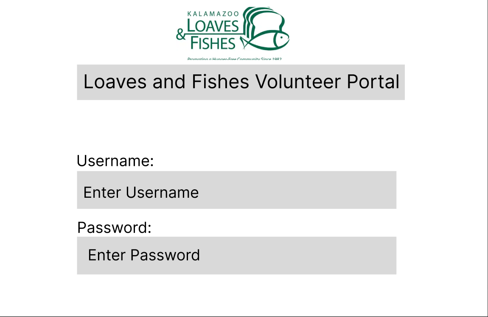
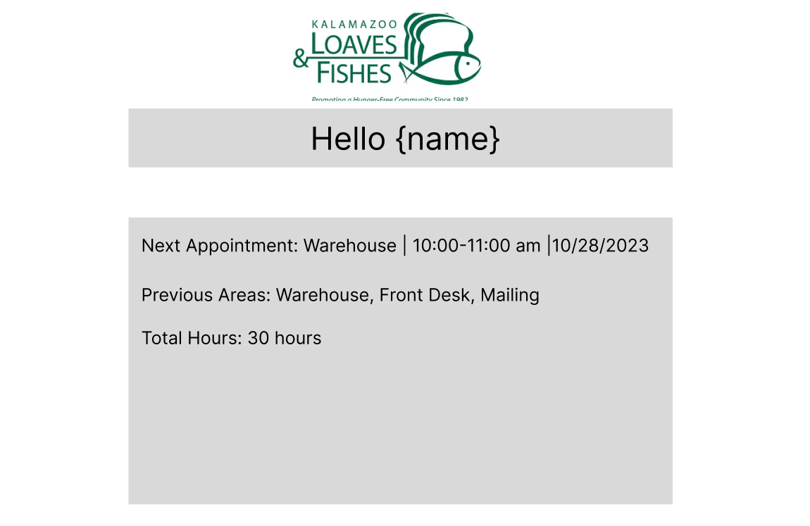

USER SPECIFICATIONS:

Functional Requirements:

- the software shall allow a user to log in using a profile created by the admin (see admin page)
- the software shall send an SMS text using the provided phone number that is connected to a user profile to remind of scheduled appointments 1 hour prior
- the software shall allow users to view their profile when logged in, described below

User Interface Requirements:
- the software shall allow users to view their profile which includes their assignment, hours scheduled, and total hours spent volunteering.
- the profile page shall have a button in the top right corner with the option to log out or change password
- a user profile will display the schedule view in calendar format, with scheduled days marked. 
- the software will also display in text below the calendar view the next scheduled appointment, in the form: "Next Shift: Monday, 10/1/23, 10:00 PM. Location: Pantry"
- the software will also display the total hours volunteered by the user
- the software shall allow users to change their password if desired
- all shift information will be input by the admin and stored in a database (see admin page)

